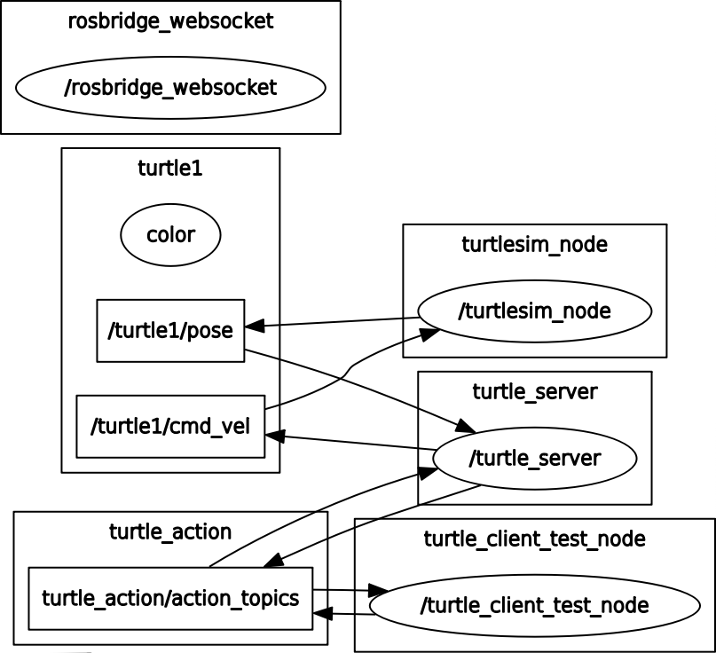
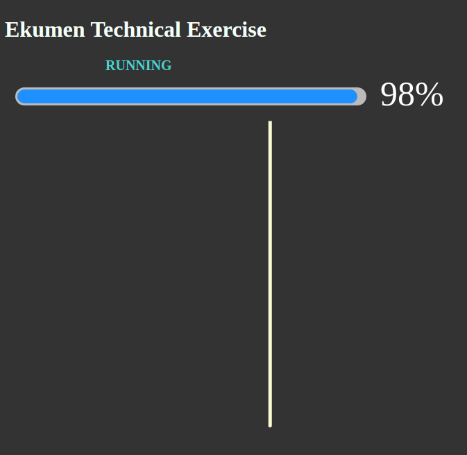

# Ekumen technical exercise

## Overview

Makes turtlesim follow specific paths and drawing them on the screen, and also, in a web browser.

The ekumen_technical_exercise package has been tested under ROS Kinetic and Ubuntu 16.04.

**Author: Emiliano Borghi**
**Affiliation: Ekumen, Buenos Aires, Argentina**

## Installation

### Building from Source

#### Dependencies

- [Robot Operating System (ROS)](http://wiki.ros.org) (middleware for robotics),
- [roslibjs](http://wiki.ros.org/roslibjs) (core JavaScript library for interacting with ROS from the browser)

		sudo apt-get install ros-<rosdistro>-rosbridge-server

#### Building

To build from source, clone the latest version from this repository into your catkin workspace and compile the package using

	cd <your_catkin_workspace>/src
	git clone https://github.com/eborghi10/ekumen_technical_exercise.git
	cd ../
	catkin_make

## Usage

### Run the complete program

	roslaunch ekumen_technical_exercise turtlesim_complete.launch

#### Passing the path as argument

With the name *path* you can let the turtle to do a specific path. The available path can be seen below.

	roslaunch ekumen_technical_exercise turtlesim_complete.launch path:=<my_path>

### Run the server and the client independently

To run the server:
	
    roslaunch ekumen_technical_exercise turtlesim_server.launch

To run the client (can receive specific paths too):

    roslaunch ekumen_technical_exercise turtlesim_client.launch path:=<my_path>

## Nodes

### turtlesim_node

turtlesim is a tool made for teaching ROS and ROS packages.

Publishes its pose into `/turtle1/pose` and moves acording to `/turtle1/cmd_vel`.

### turtle_server

Controls the Turtle given a predefined path from the `turtle_client_test_node`. This is done using the `Actionlib` package and a custom message (`ekumen_technical_exercise/TurtleAction`).

This simulation can be paused/resumed call the respective services. To know more about it, read the services section.

### turtle_client_test_node

Reads a path in YAML format and sends it to the `turtle_server`. You can execute predefined path (see *Usage* section) or you can create your own path (see *How to make a new path*).

### rqt_reconfigure

During the simulation a [Dynamic Reconfigure](http://wiki.ros.org/dynamic_reconfigure) window will be opened. You can change two parameters:

 1. Linear velocity: *max_vel*
 2. Angular velocity: *ang_vel*

If you don't want to use this capability, you can closed without changing the behavior of the simulation.

### rosbridge_websocket

It's a WebSocket interface to rosbridge, which provides a JSON API to ROS functionality for non-ROS programs. In this case, you can use a web page hosted in the `/src/web_page` folder. To know more about it, go to the section *Web page*.

#### Services

* **`pause`** ([std_srvs/Empty])

	Pauses the Turtlesim simulation.

		rosservice call /pause "{}"

* **`resume`** ([std_srvs/Empty])

	When the simulation is paused , you can resume it with this service.

		rosservice call /resume "{}"

#### Parameters

The path information (the position of the nodes) is read it by the `turtle_client_test_node` node because they are available as parameters. Next, we will see the structure.

    /turtle_client/node#/x
    /turtle_client/node#/y
    /turtle_client/node#/theta

Each node generates 3 parameters according to the `turtlesim/Pose` message type.

## Available paths

 - *complex-star*
 - *convex*
 - *equilateral*
 - *heptagon*
 - *hexagon*
 - *line*  (by default)
 - *square*
 - *star*

## How to make a new path

The path files are hosted in the `/path` folder with `.yaml` extension. The structure of them is like:

    num_nodes: #
    node0:
	    x: 0.00
	    y: 0.00
	    theta: 0.00
	node1:
		x: 0.00
		y: 0.00
		theta: 0.00

The variable `num_nodes` is used by the program to speed up the calculations. If you create 5 nodes (until `node4`), you must put `num_nodes: 5`.

The naming of `node#` starts from 0, and each one has 3 parameters: `x`, `y` and `theta`. The last one is not used, so, can took any value. but `0.00` is correct.

`x` and `y` are the node coordinates. Suggested values are between 0 and 10.

## Web page

You can see the progress and the path covered in the web browser. To open it, you will find a `turtle_webpage.html` file into the `/src/web_page` folder.

If you can't see the simulation, reload it.

If everything is configured correctly, you'll see a screen like this:

Remember to install the `rosbridge_server package`. Instructions are at the top of the document.

## Future improvements

Some improvements can be made:

 - Currently, the robot moves only in one direction (anticlockwise). To save time, it should move clockwise sometimes.
 - The robot doesn't perform angular and linear movements simultaneously because it only follows straight paths.